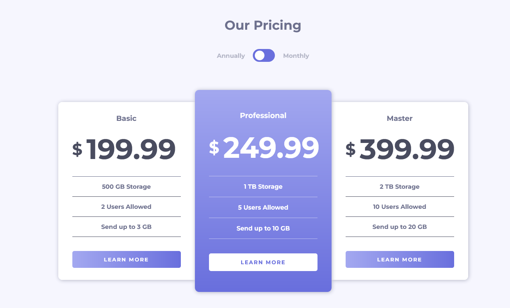

# Frontend Mentor - Pricing component with toggle solution

This is a solution to the [Pricing component with toggle challenge on Frontend Mentor](https://www.frontendmentor.io/challenges/pricing-component-with-toggle-8vPwRMIC). Frontend Mentor challenges help you improve your coding skills by building realistic projects.

## Table of contents

- [Overview](#overview)
  - [The challenge](#the-challenge)
  - [Screenshot](#screenshot)
  - [Links](#links)
- [My process](#my-process)
  - [Built with](#built-with)
- [Author](#author)

## Overview

### The challenge

Users should be able to:

- View the optimal layout for the component depending on their device's screen size
- Control the toggle with both their mouse/trackpad and their keyboard
<!-- - **Bonus**: Complete the challenge with just HTML and CSS -->

### Screenshot

### Links

- Solution URL: [https://www.frontendmentor.io/solutions/pricing-component-with-toggle-using-html-css-and-javascript-xPbMotzc6Y](https://www.frontendmentor.io/solutions/pricing-component-with-toggle-using-html-css-and-javascript-xPbMotzc6Y)
- Live Site URL: [https://sanketcharanpahadi.github.io/pricing-component-with-toggle/](https://sanketcharanpahadi.github.io/pricing-component-with-toggle/)

## My process

### Built with

- Semantic HTML5 markup
- CSS custom properties
- Flexbox
- Mobile-first workflow

## Author

<!-- - Website - [Add your name here](https://www.your-site.com) -->

- Frontend Mentor - [@sanketcharanpahadi](https://www.frontendmentor.io/profile/sanketcharanpahadi)
- Twitter - [@SanketK86551440](https://www.twitter.com/SanketK86551440)
